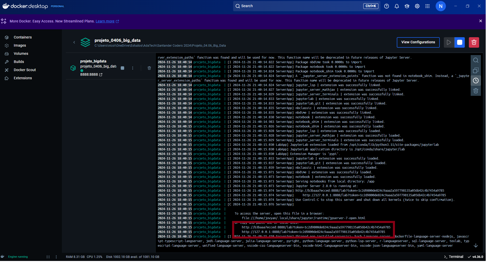
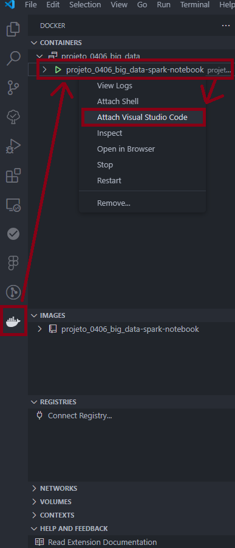
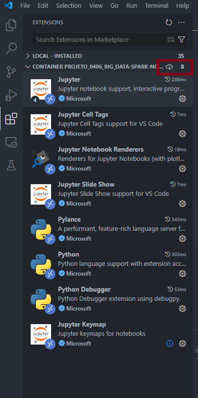
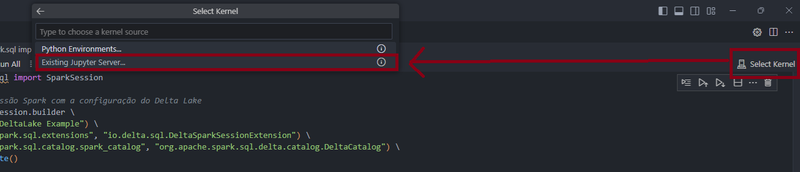
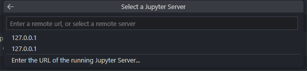

# Desenvolvimento e Avaliação de uma Arquitetura Distribuída para o Cadastro Ambiental Rural

< Descrição >

## Objetivos

## Tecnologias

# Ambiente de Desenvolvimento

Tecnologias necessárias:
* Docker
* 

## Docker 

< Explicação do *docker-compose.yaml* e *Dockerfile.jupyterspark*>

### Setup (Windows)

A imagem do containe docker utiliza os arquivos *docker-compose.yaml* e *Dockerfile.jupyterspark*. No diretório raiz do projeto, utilizar o terminal para montar a imagem e subir o container: *docker-compose -f docker/docker-compose.yaml up --build*

O container pode ser interrompido e inicializado pelo Docker Desktop. Após ser inicializado, o projeto pode ser acessado de duas formas:

#### Jupyter

Após inicializar o container, pode-se utilizar um dos links de acesso que é gerado em um navegador para acessar o projeto pela interface do jupyter. Os links podem er visualizados pelo Docker Desktop ou pelo terminal caso tenha sido utilizado para rodar a imagem.

#### VS Code

Necessário as extensões: Docker, Jupyter e as relativas ao Python (Python, Pylance, isort, etc...). 

Com o container ativo, é possível que seja acessado pela interface gráfica.

Uma nova janela do VSCode vai abrir no ambiente de desenvolvimento do container. É necessário ativar ou sincronizar as extensões locais nesse ambiente.

Selecionar um kernel selecionando um novo Jupyter Server.

Adicionar o endereço do servidor jupyter para se conectar.

