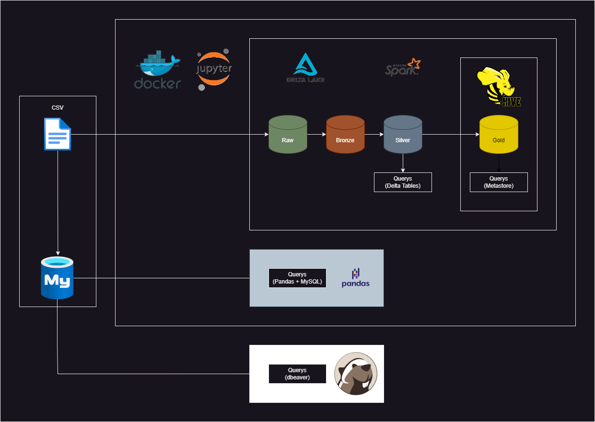

# Desenvolvimento e Avaliação de uma Arquitetura Distribuída para o Cadastro Ambiental Rural

A partir de um arquivo .csv fornecido, sobre o cadastro de propriedades rurais, deve ser proposta e implementada uma arquitetura para consumo dos dados. Em seguida realizar testes comparativos entre ambientes distribuído e centralizado além realizar medições de desempenho.

## Objetivos

* Comparação dos tempos de querys entre um banco de dados distribuído e um banco de dados centralizado.
* Demonstração da arquitetura utilizada para desenvolvimento.
* Criação de um ambiente padrão de desenvolvimento que não dependa dos diferentes Sistemas Operacionais, Hardwares, etc. dos integrantes do grupo.

# Ambiente de Desenvolvimento

Para realização do trabalho, o grupo tinha a necessidade de um ambiente de desenvolvimento padronizado e fora dos ambientes de nuvem (como Databricks, por exemplo). Por esse motivo decidiu-se configurar o ambiente com *Docker*, a partir de uma imagem que contenha o *Jupyter/Spark*, para lidar com volumes grandes de dados e já permitir consultas em *SQL*.

## Docker 

< Explicação do *docker-compose.yaml* e *Dockerfile.jupyterspark*>

### Setup (Windows)

A imagem do containe docker utiliza os arquivos *docker-compose.yaml* e *Dockerfile.jupyterspark*. No diretório raiz do projeto, utilizar o terminal para montar a imagem e subir o container: *docker-compose -f docker/docker-compose.yaml up --build*

O container pode ser interrompido e inicializado pelo Docker Desktop. Após ser inicializado, o projeto pode ser acessado de duas formas:

#### Jupyter

Após inicializar o container, pode-se utilizar um dos links de acesso que é gerado em um navegador para acessar o projeto pela interface do jupyter. Os links podem er visualizados pelo Docker Desktop ou pelo terminal caso tenha sido utilizado para rodar a imagem.

#### VS Code

Necessário as extensões: Docker, Jupyter e as relativas ao Python (Python, Pylance, isort, etc...). 

Com o container ativo, é possível que seja acessado pela interface gráfica.

Uma nova janela do VSCode vai abrir no ambiente de desenvolvimento do container. É necessário ativar ou sincronizar as extensões locais nesse ambiente.

Selecionar um kernel selecionando um novo Jupyter Server.

Adicionar o endereço do servidor jupyter para se conectar.

# Projeto

O projeto foi dividido em dois notebooks *avaliacao_centralizado.ipynb* e *avaliacao_distribuido.ipynb*.

Uma arquitetura geral do projeto pode ser visualizada na imagem:

## Ambiente Distribuído

O ambiente distribuído utiliza *Spark* e *Delta Tables*. A pipeline de dados foi feita em arquitetura Medallion, mas sem grandes limpezas necessárias. Adicionamente às consultas em *Delta Tables*, foi configurado o *Hive* para realização de Querys a partir da metastore do *Hive*.

## Ambiente Centralizado

O ambiente centralizado utiliza conexcão direto com banco de dados *MySQL*. As querys são feitas utilizando *Pandas* com conexão ao banco de dados e os arquivos salvos em *csv*.

## Even-Odd Rule

Uma das querys necessita que seja verificado se o centróide das propriedades está dentro de um polígono determinado. Para verificar essa situação foi utilizada um algoritmo de computação gráfica chamado de "Even-Odd Rule" O contexto de uso pode ser verificado [aqui](https://en.wikipedia.org/wiki/Even–odd_rule).

## Comparativo (em segundos)

| Tecnologia     | Query 1 |  Query 2 |  Query 3 |  Query 4 |  Query 5 |  Query 6 |  Query 7 |  Query 8 | Total  |
| -------------- | ------- | -------- | -------- | -------- | -------- | -------- | -------- | -------- | ------ |
| Delta Table    | 11.15   | 8.42     | 21.60    | 12.63    | 19.6     | 11.63    | 11.85    | 19.18    | 116.07 |
| Hive           | 5.74    | 6.05     | 16.43    | 7.40     | 12.50    | 6.52     | 6.64     | 9.38     | 70.66  |
| Pandas + MySQL | 4.20    | 9.48     | 319.91   | 21.66    | 67.99    | 11.58    | 5.19     | 15.69    | 455.70 |

## Incremento Futuro

Para análises e adições futuras:

* Implementar um conteiner docker com PostgreSQL para consulta (não depender do banco de dados fornecido pelo professor)

* Implementar análises com diferentes particionamentos do banco distribuído